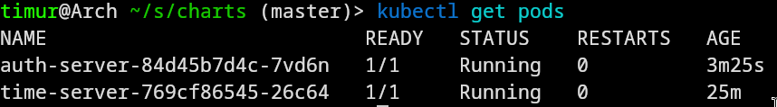
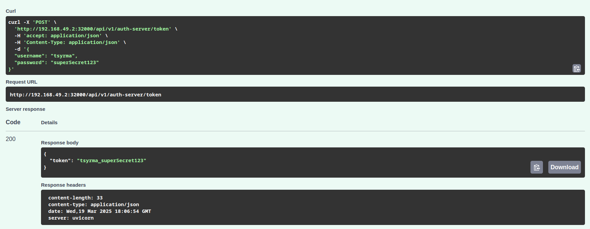
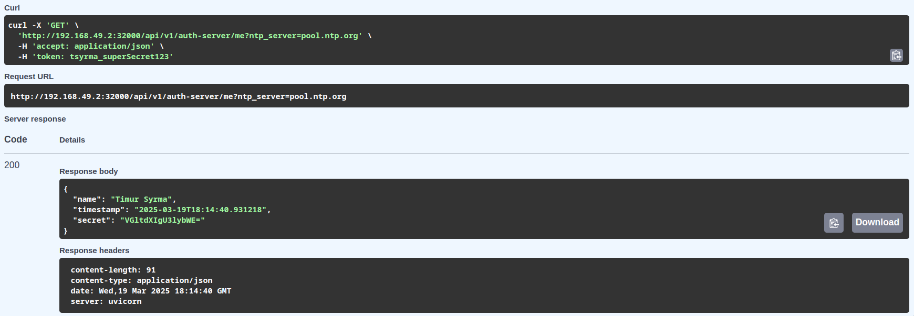

# syrma.t.e-itmo-megaschool-devops-2025

```
auth> show collections
users
auth> db.users.find().pretty()
[
  {
    _id: ObjectId('67daf8e8fe0771e5ca51e944'),
    full_name: 'Timur Syrma',
    username: 'tsyrma',
    password: 'superSecret123'
  }
]
```





---





---





---


```
----- Pods logs: auth-server-84d45b7d4c-7vd6n -----
2025-03-19 18:06:19.270 | SUCCESS  | app:startup:23 - All envvars are present, server successfully started
INFO:     Application startup complete.
INFO:     Uvicorn running on http://0.0.0.0:8000 (Press CTRL+C to quit)
http://time-server:8001
INFO:     10.244.0.1:62578 - "GET /docs HTTP/1.1" 200 OK
INFO:     10.244.0.1:62578 - "GET /openapi.json HTTP/1.1" 200 OK
INFO:     10.244.0.1:44908 - "POST /api/v1/auth-server/token HTTP/1.1" 403 Forbidden
INFO:     10.244.0.1:58346 - "POST /api/v1/auth-server/token HTTP/1.1" 200 OK
INFO:     10.244.0.1:55901 - "GET /api/v1/auth-server/sync?ntp_server=pool.ntp.org&token=myTokenValue HTTP/1.1" 404 Not Found
INFO:     10.244.0.1:49443 - "GET /api/v1/auth-server/me?ntp_server=pool.ntp.org HTTP/1.1" 200 OK

----- Pods logs: time-server-769cf86545-26c64 -----
INFO:     Started server process [1]
INFO:     Waiting for application startup.
2025-03-19 17:44:25.735 | INFO     | app:startup:11 - Running time server
INFO:     Application startup complete.
INFO:     Uvicorn running on http://0.0.0.0:8001 (Press CTRL+C to quit)
INFO:     10.244.0.17:60190 - "GET /api/v1/time-server/get_time?ntp_server=pool.ntp.org HTTP/1.1" 200 OK
INFO:     10.244.0.17:60192 - "GET /api/v1/service-keys/get_svckey?svc_token=Timur+Syrma HTTP/1.1" 200 OK
```